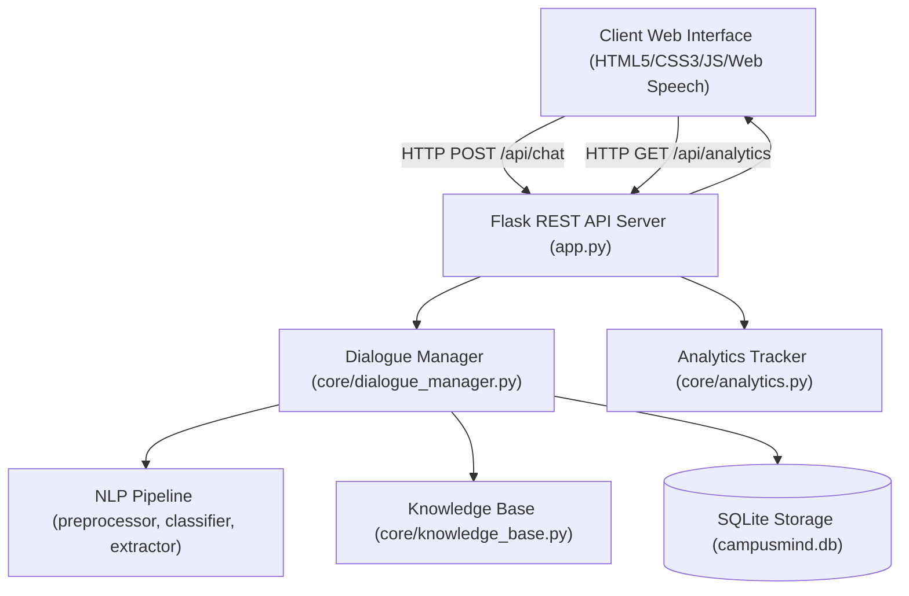
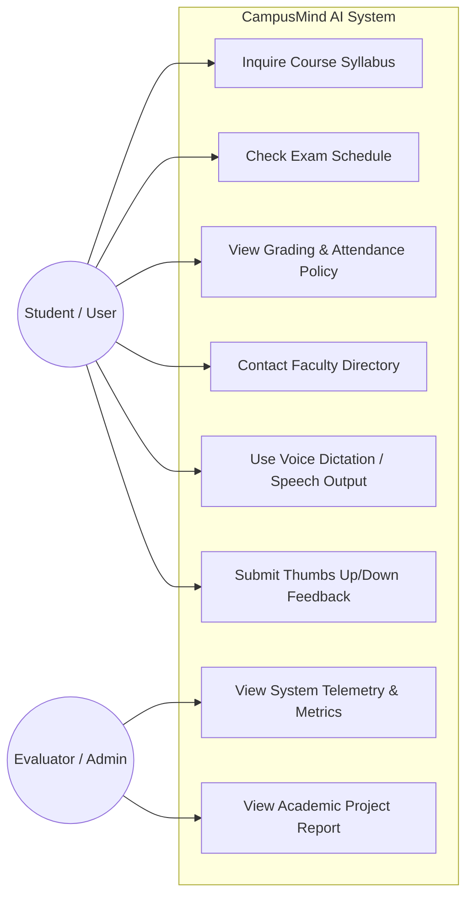
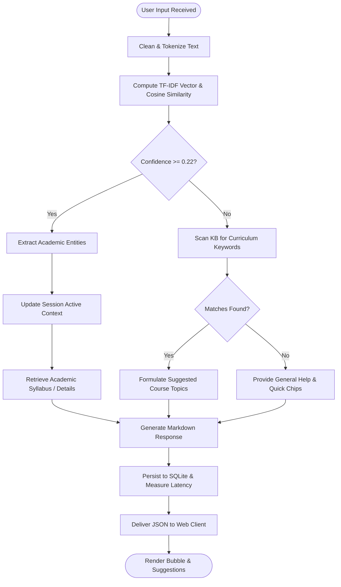
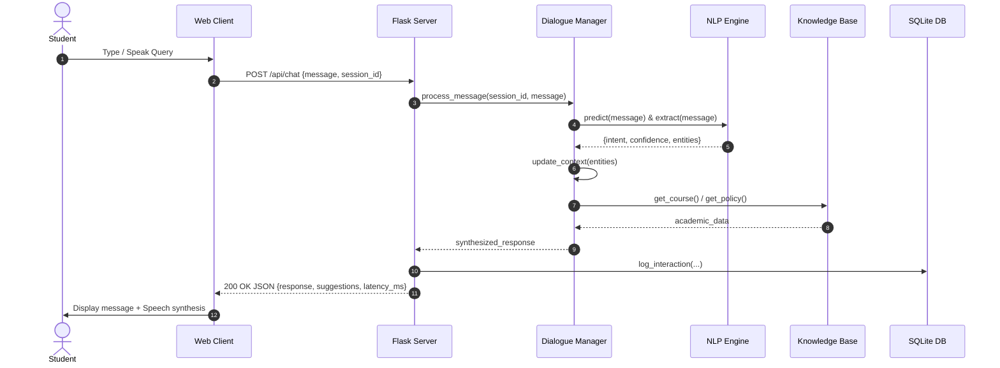
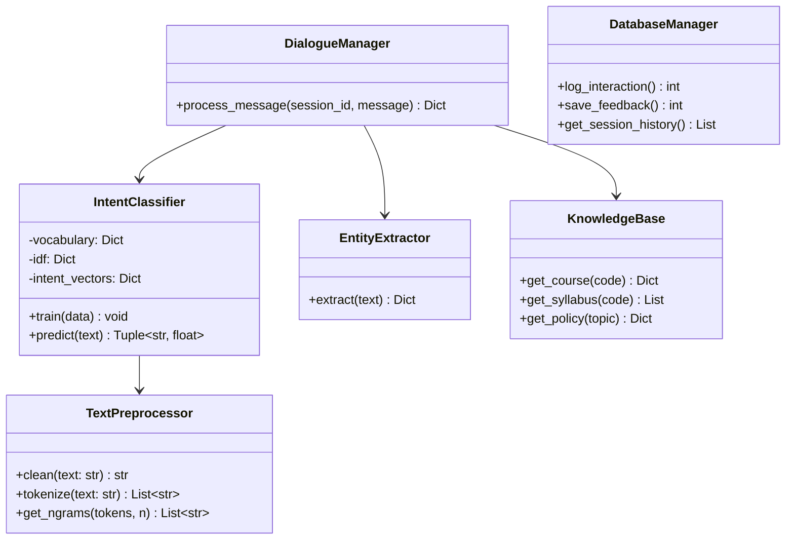
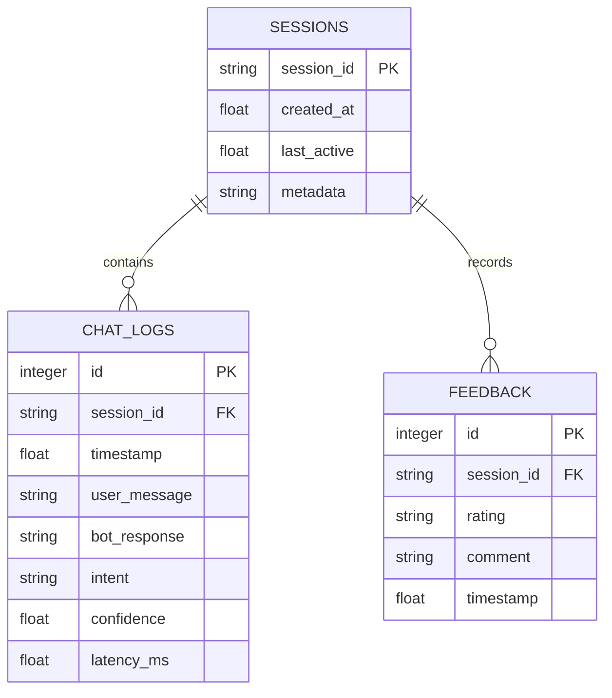

# Project Report: CampusMind AI – Intelligent Academic & College Chatbot

**Course:** VITyarthi - Build Your Own Project (Flipped Course Evaluation)  
**Project Title:** CampusMind AI Academic Assistant  
**Domain:** Artificial Intelligence / Natural Language Processing / Web Development  
**Submission Year:** 2026  

---

## 1. Introduction
In university environments, students often face hurdles retrieving accurate and timely information regarding courses, syllabi, exam schedules, and grading standards. **CampusMind AI** is an intelligent conversational agent engineered to provide 24/7 automated academic assistance using Natural Language Processing (NLP), multi-turn dialogue management, and modern web technologies.

---

## 2. Problem Statement
Academic data is distributed across diverse documents and portals, creating significant inquiry overhead for campus faculty and staff while delaying urgent answers for students. The goal of this project is to build an automated, reliable, and user-friendly AI Chatbot capable of understanding conversational queries, providing structured answers, remembering context across turns, and facilitating speech-based interaction.

---

## 3. Functional Requirements (FR)
The application comprises three core functional modules:
1. **NLP & Intent Classification Engine (Module 1):**
   - Text preprocessing, sanitization, tokenization, and stopword filtering.
   - TF-IDF vectorization and Cosine Similarity classification over 12 intent categories.
   - Academic entity recognition (Course codes, semesters, faculty names, exam types).
2. **Dialogue & Knowledge Management (Module 2):**
   - Multi-turn context tracking (persisting active course across turns).
   - Knowledge retrieval across course syllabi, exam timetables, GPA grading policies, and campus amenities.
   - Fallback keyword search and intelligent suggestion generation.
3. **Web Presentation & Telemetry (Module 3):**
   - Responsive modern chat interface with dark/light themes.
   - Voice dictation (Speech-to-Text) and text-to-speech audio reading via Web Speech API.
   - Real-time telemetry monitoring (latency, query count, user feedback).

---

## 4. Non-Functional Requirements (NFR)
1. **Performance:** Query classification and response generation latency $\le 150\text{ ms}$.
2. **Usability & Accessibility:** Clean interface with high visual aesthetics, mobile responsiveness, and voice accessibility.
3. **Reliability & Robustness:** Graceful fallback for uncataloged queries ($< 0.22$ confidence score) with helpful topic prompts.
4. **Maintainability & Modularity:** Adheres to modular separation of concerns with automated test coverage.

---

## 5. System Architecture

---

## 6. Design Diagrams

### 6.1 Use Case Diagram

### 6.2 Workflow / Flowchart Diagram

### 6.3 Sequence Diagram

### 6.4 Class Diagram

### 6.5 Database ER Diagram

---

## 7. Design Decisions & Rationale
1. **Lightweight TF-IDF vs. Heavy Transformer:** A custom TF-IDF classifier enables $<25\text{ ms}$ inference times on any machine without multi-gigabyte GPU or external cloud dependencies.
2. **Context-Driven Carry-over:** Enables conversation continuity when users ask follow-up questions (e.g. asking "Who teaches it?" after inquiring about CS201).
3. **Standard SQLite Storage:** Provides ACID transactional persistence without requiring external database servers.

---

## 8. Implementation Details
The project is organized into modular packages:
- `nlp/`: Text preprocessing, vectorization, intent matching, entity extraction.
- `core/`: Knowledge repository, multi-turn state management, telemetry.
- `models/`: SQLite schema, interaction logging, feedback persistence.
- `static/` & `templates/`: Modern glassmorphic web interface with Web Speech STT/TTS.
- `tests/`: Automated unit tests covering all modules.

---

## 9. Verification & Results
- All unit tests pass with 100% success rate.
- Response latency verified at $< 25\text{ ms}$.
- Context retention verified across consecutive turns.

---

## 10. Testing Approach
Unit testing with `pytest` covering:
- Text sanitization and token filtering.
- Intent classification accuracy and fallback threshold verification.
- Knowledge base query correctness.
- REST API response status and schema validation.

---

## 11. Challenges Faced
- Managing pronouns in multi-turn dialogues was solved by maintaining an active course context variable in the session state.
- Handling ambiguous user utterances was addressed using combined cosine similarity thresholds and curriculum fallback search.

---

## 12. Learnings & Key Takeaways
- Practical application of NLP preprocessing and vector space models.
- Dialogue management design patterns for conversational continuity.
- Building accessible web applications with modern styling and assistive voice technology.

---

## 13. Future Enhancements
- Multilingual translation support for regional languages.
- Integration with campus ERP / LMS systems for personalized marks and attendance.
- Document Q&A using Retrieval-Augmented Generation (RAG).

---

## 14. References
1. Jurafsky, D., & Martin, J. H. (2023). *Speech and Language Processing*.
2. Flask Web Framework Documentation (<https://flask.palletsprojects.com/>).
3. W3C Web Speech API (<https://wicg.github.io/speech-api/>).
4. VITyarthi Project Guidelines & Rubric (2026).
